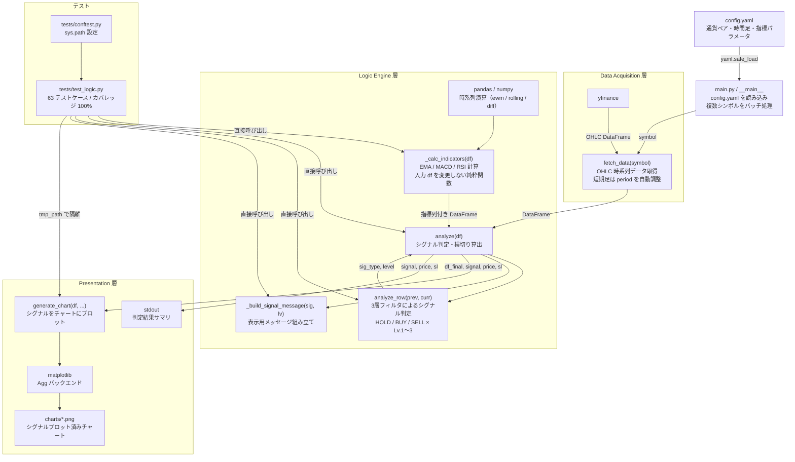

# FX-Compass Pro (為替羅針盤 Pro)

[](https://github.com/YusukeHarada/fx-compass/actions/workflows/test.yml)

FX-Compass Proは、為替相場のテクニカル分析を自動化し、統計的な優位性に基づいた意思決定を支援するマルチシンボル・スキャニングツールです。

---

## I. ユーザーガイド (User Guide)

### 1. 概要

本ツールは、主要なテクニカル指標である MACD と RSI を組み合わせ、相場の転換点を 3 段階のシグナル強度で判定します。複数の通貨ペアを同時にスキャンし、視覚化されたチャートと具体的な損切りラインを提示します。

### 2. クイックスタート

#### 必要環境

* Python 3.10 以上
* インターネット接続（為替データの取得用）

#### セットアップ

```bash
pip install -r requirements.txt
```

#### 実行方法

1. `config.yaml` で監視したい通貨ペアや時間足を編集します。
2. 以下のコマンドを実行します。

```bash
python main.py
```

3. `charts/` ディレクトリに生成された画像を確認し、分析結果を評価します。

#### テストの実行

```bash
pytest tests/ --cov=main --cov-report=term-missing
```

### 3. シグナル判定の読み方

| シグナル | 説明 |
|---------|------|
| **Lv.1 (WATCH)** | トレンド転換の可能性を示唆。監視を開始するフェーズ。 |
| **Lv.2 (STANDARD)** | 統計的な反転の可能性が高い状態。 |
| **Lv.3 (STRONG)** | 複数の指標が一致し、高い優位性が認められる状態。 |

### 4. config.yaml パラメータ仕様

| キー | 説明 | 備考 |
|-----|------|------|
| `trading.symbols` | 監視する通貨ペアのリスト | yfinance 形式（例: `USDJPY=X`） |
| `trading.interval` | 時間足 | `1m` `5m` `15m` `1h` `1d` |
| `trading.period` | データ取得期間 | `1m`/`5m` 足では自動的に `1d` に上書き |
| `logic.macd.fast` | MACD 短期 EMA 期間 | デフォルト: 12 |
| `logic.macd.slow` | MACD 長期 EMA 期間 | デフォルト: 26 |
| `logic.macd.signal` | MACD シグナル期間 | デフォルト: 9 |
| `logic.rsi.length` | RSI 計算期間 | デフォルト: 14 |
| `logic.rsi.buy_threshold` | RSI 買い閾値（Lv.3 下限） | デフォルト: 30 |
| `logic.rsi.sell_threshold` | RSI 売り閾値（Lv.3 上限） | デフォルト: 70 |
| `risk.stop_loss_pct` | 損切り幅（小数） | デフォルト: 0.01（1.0%） |

### 5. 設計上の制約・既知の限界

* **利確ロジックは持たない** — 損切り（Stop Loss）のみ定義。利確タイミングは利用者が判断する。
* **直近 2 本のみで判定** — シグナルは最新のローソク足 2 本のクロス状態のみを参照する。
* **シグナル連続出力の制御なし** — 連続して BUY シグナルが出た場合のナンピン禁止などのルールは持たない。
* **外部 API 依存** — `yfinance` の仕様変更・障害時はデータ取得が失敗する。エラーはシンボル単位で握り潰してコンソール出力する。
* **短期足の精度** — `1m`/`5m` 足はノイズが多くダマシが増える。`1h` 以上を推奨。
* **投資助言ではない** — 本ツールの出力は意思決定の補助情報であり、売買を推奨するものではない。

---

## II. 技術仕様書 (Technical Specifications)

本セクションでは、本ソフトウェアの設計思想、構造、および品質保証プロセスについて、ソフトウェア工学の観点から記述します。

### 1. 要求定義 (Requirements Definition)

#### 1.1 機能的要求

* **多変量テクニカル分析**: MACD および RSI の各指標を統合し、多段階のバリデーション（検証）を経て最終判定を出力すること。
* **マルチシンボル・スキャニング**: 定義された複数シンボルに対するバッチ処理を行い、一貫した分析結果を提供すること。
* **データ・ビジュアライゼーション**: 分析結果を静的ファイル（PNG）として出力し、判定根拠をグラフィカルに提示すること。
* **リスク・パラメータの提示**: エントリー価格に対する動的なリスク許容範囲（Stop Loss）を算術的に算出すること。

#### 1.2 非機能的要求

* **可搬性 (Portability)**: 特定のバイナリライブラリに依存せず、標準的な科学計算ライブラリ（pandas / numpy）のみで指標計算を実装することで、ランタイム環境（CI/CD、各種OS）における互換性を確保する。
* **保守性 (Maintainability)**: アルゴリズムを内部カプセル化し、外部ライブラリの仕様変更による影響を最小限に抑える「ホワイトボックス設計」を採用する。
* **副作用の排除**: 指標計算メソッド（`_calc_indicators`）は入力 DataFrame を変更しない純粋関数として実装する。

### 2. システム設計 (System Design)

#### 2.1 アーキテクチャ設計

本システムは、**「疎結合なパイプライン・アーキテクチャ」** を採用しています。

1. **Data Acquisition 層**: `yfinance` を通じた時系列データの取得。
2. **Logic Engine 層**: 統計指標の算出および判定アルゴリズムの適用。
3. **Presentation 層**: Matplotlib を用いた視覚化およびレポート出力。

#### 2.2 ソフトウェアモジュール構成図



#### 2.3 判定アルゴリズムの状態遷移

判定ロジックは以下の条件分岐構造に基づき、偽陽性（False Positive）を抑制するように設計されています。

| MACD 位置 | クロス種別 | RSI 範囲 | シグナル | レベル |
|-----------|-----------|---------|---------|-------|
| ゼロ以上 | ゴールデンクロス | any | BUY | Lv.1 (WATCH) |
| ゼロ未満 | ゴールデンクロス | 範囲外（< 30 または > 50） | BUY | Lv.2 (STANDARD) |
| ゼロ未満 | ゴールデンクロス | 30 ≦ RSI ≦ 50 | BUY | Lv.3 (STRONG) |
| ゼロ以下 | デッドクロス | any | SELL | Lv.1 (WATCH) |
| ゼロ超 | デッドクロス | 範囲外（< 50 または > 70） | SELL | Lv.2 (STANDARD) |
| ゼロ超 | デッドクロス | 50 ≦ RSI ≦ 70 | SELL | Lv.3 (STRONG) |
| — | クロスなし | any | HOLD | Lv.0 |

### 3. 品質保証とトレーサビリティ (Quality & Traceability)

#### 3.1 テスト構成

| テストクラス | 観点 | 主な検証内容 |
|-------------|------|------------|
| `TestCalcIndicators` | ホワイトボックス | EMA の収束・RSI の上下限・副作用なし・ゼロ除算耐性 |
| `TestAnalyzeRow` | ブラックボックス | 全シグナル状態遷移・RSI 境界値（29/30/50/51/49/70/71） |
| `TestBuildSignalMessage` | ブラックボックス | 全 7 パターン（HOLD / BUY Lv.1〜3 / SELL Lv.1〜3） |
| `TestAnalyze` | ブラックボックス | 返り値・損切り価格算出・入力不変性・データ不足 |
| `TestAnalyzeSlPriceDirect` | ブラックボックス | モックによる BUY/SELL 損切り価格の実値検証 |
| `TestRobustness` | 堅牢性 | NaN 含有・定数系列・データ本数の境界（1本/2本） |
| `TestGenerateChart` | 副作用 | PNG 出力の存在・出力先・ファイル名の正確性 |
| `TestGenerateChartSignalMarker` | 副作用 | BUY シグナルマーカー描画ブランチの到達確認 |
| `TestFetchData` | モック | yfinance 呼び出し・period 自動調整・MultiIndex 処理 |
| `TestMainFlow` | 統合 | fetch_data → analyze → generate_chart のパイプライン |
| `TestMainEntrypoint` | 統合 | `__main__` ブロックの正常系・例外系 |

#### 3.2 テストカバレッジ

`pytest-cov` を採用し、動的解析によるテスト網羅率を管理しています。

* **目標**: `main.py` における C0（命令網羅）100% の維持。
* **現状**: `main.py` 100% 達成（63 テストケース）。

```bash
pytest tests/ --cov=main --cov-report=term-missing
```

---

**FX-Compass Pro: Engineering-Driven Trade Analysis.**